# MGPUSim MI300A Curated Validation Report

**Hardware reference:** AMD Instinct MI300A 
**Data source:** `benchmark-comparison/comparison_ci.csv` 
**Policy:** [Validation Point Selection](validation_point_selection.md) 
**Scope:** Curated MI300A primary evaluation set 
**Curated set:** `mi300a-curated-primary` version `2026.04.26-m67.partial-current` 
**Matched:** 18 kernels, 182 data points (88 flat, 94 non-flat)

*This report is auto-generated by `scripts/generate_validation_report.py`. Do not edit manually.*

## Curated Primary Evaluation Set

Selected benchmarks: **18** (Tier 1: **6**, Tier 2: **12**).
Coverage status: **partial** with 15/18 manifest-full coverage benchmark(s), 3 partial current-data benchmark(s), 182/307 matched points, 88/99 flat, 94/208 non-flat, and 182 trend points.
Partial entries are retained for historical/category continuity but are not counted as full point-coverage passes: `fused_swiglu`, `nn`, `rope`.

### Category Counts

| Category | Benchmarks |
|----------|-----------:|
| dense_linear_algebra_factorization | 1 |
| device_memory_write_probe | 1 |
| device_to_host_transfer_probe | 1 |
| dynamic_programming | 1 |
| embarrassingly_parallel_compute | 1 |
| global_memory_copy_probe | 1 |
| histogram_atomic_memory | 1 |
| host_to_device_transfer_probe | 1 |
| irregular_graph_tree_traversal | 1 |
| l1_cache_bandwidth_probe | 1 |
| l2_cache_bandwidth_probe | 1 |
| ml_fused_activation | 1 |
| ml_positional_embedding | 1 |
| monte_carlo_particle_tracking | 1 |
| nearest_neighbor_search | 1 |
| scientific_compute | 1 |
| stencil_thermal | 1 |
| tiled_dense_gemm | 1 |

> **Broad-suite diagnostics policy:** Curated primary benchmarks are the tuning/evaluation surface for this report. Non-selected broad-suite kernels remain secondary diagnostics and regression signals; they are excluded here unless promoted into the curated manifest.

---

## 1. Aggregate Accuracy

### Primary Metrics (scored per-benchmark booster)

| Metric | Value | Target |
|--------|------:|-------:|
| **Mean Average Error (scored booster)** | 89.5% (16 benchmarks) | ≤ 20% |
| **Mean Scaling Factor Error** | 204.6% (15 benchmarks) | ≤ 20% |

> **Average error** measures per-point accuracy after removing systematic constant offset (booster) only for benchmarks whose scaling axis is informative. **Scaling factor error** measures whether the simulator correctly predicts how performance scales with input size — this is what academic papers rely on.
> **Excluded from boosted targets:** 2 metadata-gated benchmark(s): l1_cache_bw, l2_cache_bw. These are either archived constant-work cache-residency sweeps or work-scaling rows still pending loaded value-change proof; raw and diagnostic boosted values remain in the detailed tables.

### Tier-Separated Metrics

| Tier | Benchmarks | Avg Error (scored booster) | Target | Scaling Err | Compliant |
|------|-----------|--------------------:|-------:|------------:|----------:|
| Tier 1 (microbenchmarks) | 4/6 | 92.1% | ≤ 10% | 184.4% | 5/6 |
| Tier 2 (algorithm kernels) | 12/12 | 88.6% | ≤ 20% | 212.0% | 9/12 |

### Supporting Metrics

| Region | Points | WMAPE (raw) | WMAPE (with booster) |
|--------|-------:|------------:|---------------------:|
| Non-flat | 94 | 95.1% | 85.2% |
| Flat | 88 | 88.3% | — |
| All combined | 182 | 95.0% | — |
| Spearman ρ (all) | — | +0.6782 | — |

### Hardware-Flat / Work-Scaling Sweep Classification

These report-side annotations preserve the raw CSV rows while separating archived fixed-work cache-residency plateaus from current cache-bandwidth work-scaling evidence. Archived selected-run rows become diagnostic-only only when their provenance and row-summary gate passes. Work-scaled rows are scored/trended only after loaded hardware rows prove non-flat/value-changing behavior. For current L1 rows, HIP/CUDA keeps a fixed `working_set_size`, while the Go simulator keeps each 256-thread read group L1-resident and lets total input allocation grow with `num_elements`.

| Benchmark | Report class | Axis | Axis role | Work scaled? | Total read bytes | Implementation footprint | HW flat/non-flat | Matched pts | Metric policy | Source |
|-----------|--------------|------|-----------|-------------:|------------------|--------------------------|----------------:|------------:|---------------|--------|
| l1_cache_bw | cache bandwidth work-scaling sweep (pending value-change proof) | num_elements | work_amount_sweep | yes | total_read_bytes = num_elements * num_iterations * bytes_per_read; HIP/CUDA default 262144000 B; repeat count HIP/CUDA `num_iterations`, Go simulator `num_repeats` | HIP/CUDA fixed working_set_size 8192 B; repeat num_iterations; Go simulator 256-thread read groups (1024 B each); input bytes = ceil(num_elements / 256) * 256 * bytes_per_read; repeat num_repeats | 16/0 | 16 | diagnostic until loaded rows prove value-changing behavior | workloads/microbench/l1_cache_bw/params.json |
| l2_cache_bw | cache bandwidth work-scaling sweep (pending value-change proof) | num_elements | work_amount_sweep | yes | total_read_bytes = num_elements * num_iterations * bytes_per_read; HIP/CUDA default 524288000 B; repeat count HIP/CUDA `num_iterations`, Go simulator `num_repeats` | — | 16/0 | 5 | diagnostic until loaded rows prove value-changing behavior | workloads/microbench/l2_cache_bw/params.json |

### Cache-Bandwidth Evidence Snapshot

This snapshot keeps L1/L2 cache-bandwidth evidence explicit: row counts and raw errors are always from loaded CSV rows; constant-offset boosters are diagnostic unless the metadata gate marks the row scored; trend/shape metrics are shown even when excluded from aggregate targets.

| Benchmark | Report class | HW rows | Completed sim rows | HW flat/non-flat | HW max/min | Raw avg/W | Fixed-offset implication | Trend/shape diagnostics | Evidence status |
|-----------|--------------|--------:|-------------------:|----------------:|-----------:|-----------:|--------------------------|-------------------------|-----------------|
| l1_cache_bw | cache bandwidth work-scaling sweep (pending value-change proof) | 16 | 16 | 16/0 | 1.148× | 94.0%/94.0% | booster +0.1150 ms; diagnostic avg err 1.2%, not scored | ρ +0.7941; HW slope 2.7111e-08; sim slope 5.8040e-09; diag scaling err 78.6% | value-change proof failed: loaded_hardware_value_changing |
| l2_cache_bw | cache bandwidth work-scaling sweep (pending value-change proof) | 16 | 5 | 16/0 | 1.009× | 89.5%/89.5% | booster +0.0832 ms; diagnostic avg err 0.4%, not scored | ρ -0.5000; HW slope -2.0469e-10; sim slope 5.5248e-10; diag scaling err 369.9% | value-change proof failed: loaded_hardware_value_changing |

---

## Performance Comparison

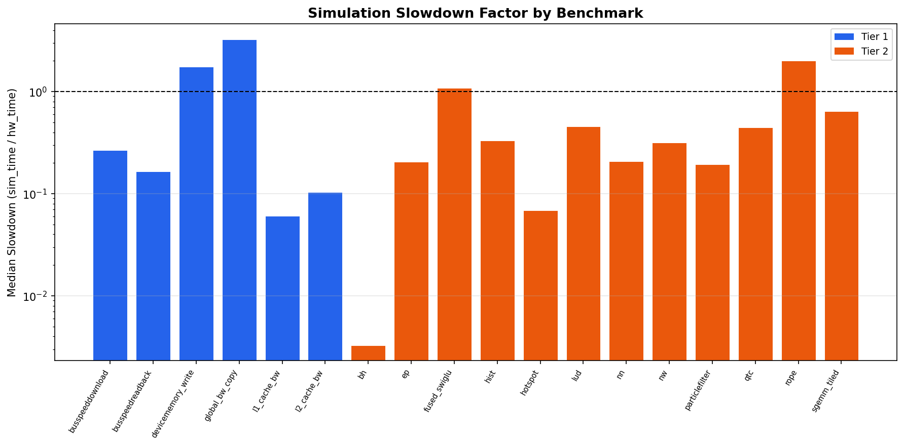

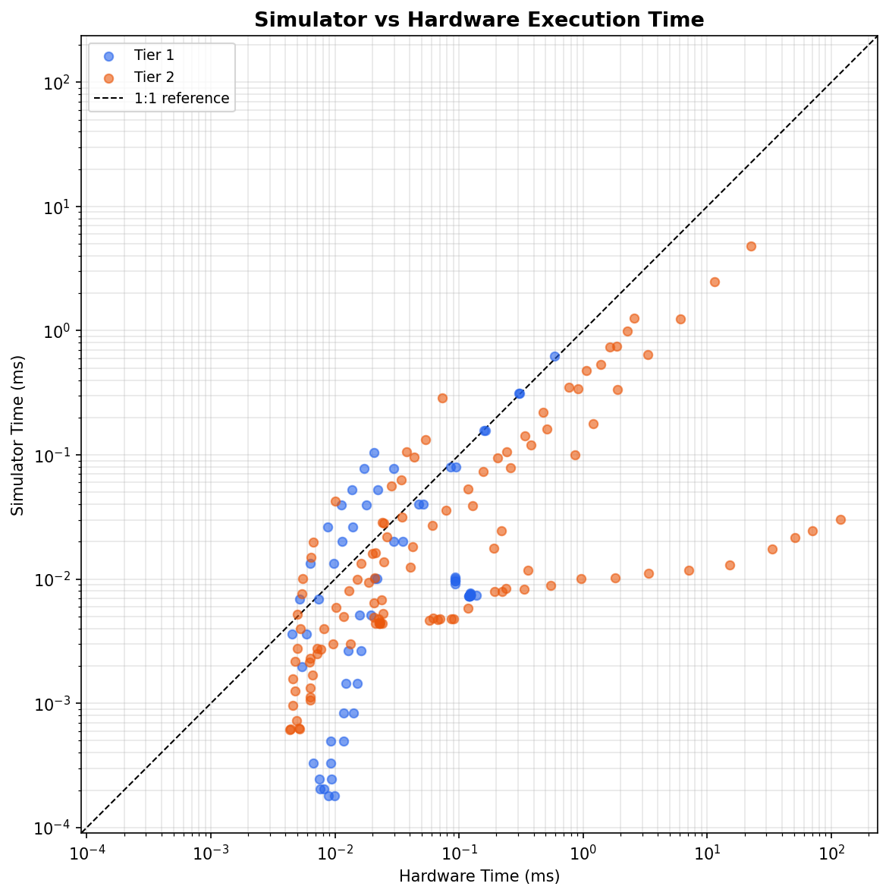

### Slowdown Summary Statistics

| Tier | Median Slowdown | Mean Slowdown |
|------|----------------:|--------------:|
| Tier 1 (microbenchmarks) | 0.216× | 0.935× |
| Tier 2 (algorithm kernels) | 0.324× | 0.498× |
| **All** | 0.292× | 0.644× |

---

## Trend Accuracy

Trend ratio = `sim_slope / hw_slope` for benchmarks with ≥ 3 data points and an informative work-scaling axis. A value near 1.0 means the simulator correctly captures how performance scales with input size. Report-classified constant-work cache-residency sweeps and work-scaling rows pending loaded value-change proof are omitted from trend scoring.

| Benchmark | Tier | HW Slope | Sim Slope | Trend Ratio |
|-----------|-----:|---------:|----------:|------------:|
| bh | 2 | 2.8841e-04 | 5.6785e-08 | 0.0002 |
| busspeeddownload | 1 | 1.7354e-08 | 1.8659e-08 | 1.0752 |
| busspeedreadback | 1 | 1.7854e-08 | 1.8722e-08 | 1.0486 |
| devicememory_write | 1 | 4.9355e-10 | 1.5454e-09 | 3.1312 |
| ep | 2 | 3.4904e-08 | 1.5314e-08 | 0.4387 |
| fused_swiglu | 2 | 3.4125e-09 | 2.6647e-08 | 7.8085 |
| global_bw_copy | 1 | 5.0491e-10 | 3.0906e-09 | 6.1210 |
| hist | 2 | 1.8112e-09 | 6.1988e-09 | 3.4224 |
| hotspot | 2 | 2.9374e-04 | 2.4393e-05 | 0.0830 |
| lud | 2 | 4.3013e-03 | 2.0232e-03 | 0.4704 |
| nn | 2 | 1.8248e-09 | 1.8447e-08 | 10.1091 |
| nw | 2 | 1.7695e-03 | 7.3904e-04 | 0.4176 |
| particlefilter | 2 | 1.3391e-03 | 2.9116e-04 | 0.2174 |
| qtc | 2 | 1.6321e-04 | 6.8901e-05 | 0.4222 |
| sgemm_tiled | 2 | 5.9468e-05 | 6.1003e-05 | 1.0258 |

### Mean Trend Ratio by Tier

| Tier | Benchmarks | Mean Trend Ratio |
|------|----------:|-----------------:|
| Tier 1 | 4 | 2.8440 |
| Tier 2 | 11 | 2.2196 |

---

## 2. Point Coverage Compliance

**14** compliant, **4** non-compliant, **0** with no sim data.

Policy requires ≥ 1 flat point (if flat region exists) and ≥ 5 non-flat points (if non-flat region exists).
For curated scope, the manifest-full/partial status above follows the per-entry manifest expectations; this table remains the broad flat/non-flat report-compliance view for the loaded rows.

### Non-Compliant Benchmarks

| Benchmark | Flat Pts | Non-flat Pts | HW Flat | HW Non-flat | Gap |
|-----------|----------|-------------|---------|-------------|-----|
| fused_swiglu | 5 | 1 | 5 | 13 | non-flat: 1/5 |
| global_bw_copy | 4 | 4 | 4 | 12 | non-flat: 4/5 |
| nn | 11 | 0 | 11 | 5 | non-flat: 0/5 |
| rope | 2 | 4 | 2 | 14 | non-flat: 4/5 |

---

## 3. Per-Benchmark Accuracy

Scored rows are sorted by average error with booster (primary metric). Non-scored diagnostic rows and benchmarks without data are sorted to the end.

| Benchmark | Tier | Pts | Scaling class | Avg Err | Avg Err (boosted) | Scaling Err | Booster | ρ | Compliant |
|-----------|-----:|----:|---------------|--------:|------------------:|------------:|--------:|--:|-----------|
| sgemm_tiled | 2 | 8 | — | 34.1% | 2.6% | 2.6% | +0.0042 ms | +1.0000 | ✅ |
| busspeeddownload | 1 | 16 | — | 58.1% | 6.9% | 7.5% | +0.0088 ms | +0.9853 | ✅ |
| busspeedreadback | 1 | 15 | — | 64.4% | 19.6% | 4.9% | +0.0117 ms | +0.9643 | ✅ |
| ep | 2 | 11 | — | 77.0% | 25.5% | 56.1% | +0.0183 ms | +0.7545 | ✅ |
| hist | 2 | 16 | — | 72.8% | 33.7% | 242.2% | +0.0050 ms | +0.9824 | ✅ |
| hotspot | 2 | 11 | — | 93.4% | 38.1% | 91.7% | +0.0860 ms | +0.8273 | ✅ |
| nn | 2 | 11 | — | 82.4% | 51.7% | 910.9% | +0.0036 ms | +0.6455 | ⚠️ |
| nw | 2 | 7 | — | 65.6% | 56.3% | 58.2% | +0.3519 ms | +1.0000 | ✅ |
| lud | 2 | 7 | — | 54.2% | 57.0% | 53.0% | +0.5789 ms | +1.0000 | ✅ |
| qtc | 2 | 10 | — | 54.0% | 71.6% | 57.8% | +0.0380 ms | +1.0000 | ✅ |
| particlefilter | 2 | 7 | — | 81.9% | 82.0% | 78.3% | +2.6630 ms | +1.0000 | ✅ |
| devicememory_write | 1 | 9 | — | 81.2% | 101.3% | 213.1% | -0.0086 ms | +1.0000 | ✅ |
| fused_swiglu | 2 | 6 | — | 108.3% | 109.6% | 680.8% | -0.0005 ms | +1.0000 | ⚠️ |
| rope | 2 | 6 | — | 113.4% | 130.9% | — | -0.0405 ms | +1.0000 | ⚠️ |
| global_bw_copy | 1 | 8 | — | 206.9% | 240.6% | 512.1% | -0.0229 ms | +1.0000 | ⚠️ |
| bh | 2 | 13 | — | 98.9% | 404.0% | 100.0% | +3.3800 ms | +0.9945 | ✅ |
| l2_cache_bw | 1 | 5 | cache bandwidth work-scaling sweep (pending value-change proof) | 89.5% | not scored (diag 0.4%) | not scored (diag 369.9%) | +0.0832 ms | -0.5000 | ✅ |
| l1_cache_bw | 1 | 16 | cache bandwidth work-scaling sweep (pending value-change proof) | 94.0% | not scored (diag 1.2%) | not scored (diag 78.6%) | +0.1150 ms | +0.7941 | ✅ |

---

## 4. Per-Benchmark Data Tables & Figures

Each section shows the raw data points, region classification, and a scaling figure. Orange-shaded area in figures indicates the flat (overhead-dominated) region.

### bh

**Points:** 13 total (3 flat, 10 non-flat) 
**Avg Error:** 98.9% (raw), 404.0% (with booster) 
**Scaling Factor Error:** 100.0% · **Booster:** +3.3800 ms 
**HW Slope:** 2.8841e-04 · **Sim Slope:** 5.6785e-08 
**ρ:** +0.9945 · **Status:** ✅ Compliant

| Size | HW (ms) | Sim (ms) | Sim+Booster (ms) | Error (raw) | Error (boosted) | Region |
|------|--------:|---------:|------------------:|------------:|----------------:|--------|
| 256 | 0.1932 | 0.0080 | 3.3880 | -95.9% | +1653.6% | flat |
| 512 | 0.2378 | 0.0084 | 3.3884 | -96.5% | +1324.9% | flat |
| 1024 | 0.3349 | 0.0083 | 3.3883 | -97.5% | +911.7% | flat |
| 2048 | 0.5491 | 0.0089 | 3.3890 | -98.4% | +517.2% | **non-flat** |
| 4096 | 0.9581 | 0.0100 | 3.3901 | -99.0% | +253.8% | **non-flat** |
| 8192 | 1.8238 | 0.0103 | 3.3903 | -99.4% | +85.9% | **non-flat** |
| 16384 | 3.3911 | 0.0111 | 3.3911 | -99.7% | +0.0% | **non-flat** |
| 32768 | 7.1176 | 0.0118 | 3.3918 | -99.8% | -52.3% | **non-flat** |
| 65536 | 15.2464 | 0.0130 | 3.3930 | -99.9% | -77.7% | **non-flat** |
| 131072 | 33.3204 | 0.0174 | 3.3974 | -99.9% | -89.8% | **non-flat** |
| 196608 | 50.7186 | 0.0217 | 3.4017 | -100.0% | -93.3% | **non-flat** |
| 262144 | 70.2316 | 0.0246 | 3.4046 | -100.0% | -95.2% | **non-flat** |
| 393216 | 118.2350 | 0.0304 | 3.4104 | -100.0% | -97.1% | **non-flat** |

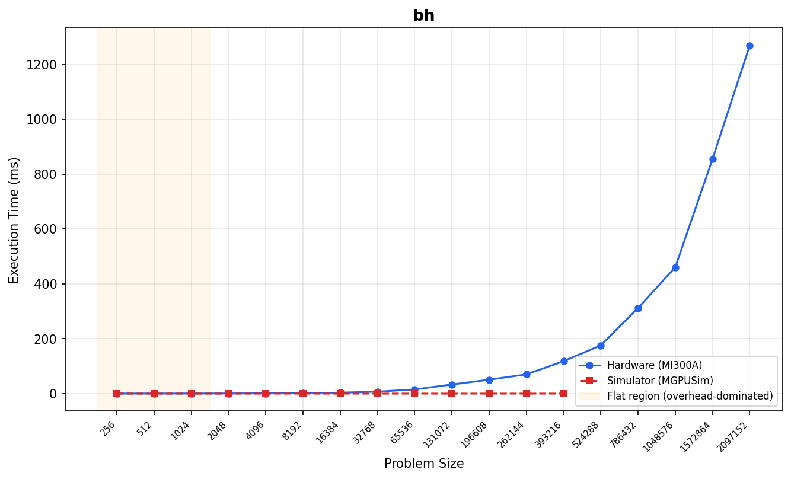

### busspeeddownload

**Points:** 16 total (9 flat, 7 non-flat) 
**Avg Error:** 58.1% (raw), 6.9% (with booster) 
**Scaling Factor Error:** 7.5% · **Booster:** +0.0088 ms 
**HW Slope:** 1.7354e-08 · **Sim Slope:** 1.8659e-08 
**ρ:** +0.9853 · **Status:** ✅ Compliant

| Size | HW (ms) | Sim (ms) | Sim+Booster (ms) | Error (raw) | Error (boosted) | Region |
|------|--------:|---------:|------------------:|------------:|----------------:|--------|
| 1KB | 0.0089 | 0.0002 | 0.0090 | -98.0% | +0.9% | flat |
| 2KB | 0.0081 | 0.0002 | 0.0090 | -97.5% | +11.1% | flat |
| 4KB | 0.0094 | 0.0002 | 0.0090 | -97.4% | -3.8% | flat |
| 8KB | 0.0092 | 0.0003 | 0.0091 | -96.4% | -0.8% | flat |
| 16KB | 0.0092 | 0.0005 | 0.0093 | -94.6% | +1.0% | flat |
| 32KB | 0.0117 | 0.0008 | 0.0096 | -92.9% | -17.7% | flat |
| 64KB | 0.0122 | 0.0014 | 0.0102 | -88.1% | -16.0% | flat |
| 128KB | 0.0128 | 0.0027 | 0.0115 | -79.2% | -10.5% | flat |
| 256KB | 0.0158 | 0.0052 | 0.0140 | -67.3% | -11.6% | flat |
| 512KB | 0.0210 | 0.0101 | 0.0189 | -51.8% | -10.0% | **non-flat** |
| 1024KB | 0.0296 | 0.0200 | 0.0288 | -32.4% | -2.7% | **non-flat** |
| 2048KB | 0.0473 | 0.0398 | 0.0486 | -15.8% | +2.8% | **non-flat** |
| 4096KB | 0.0859 | 0.0795 | 0.0883 | -7.5% | +2.7% | **non-flat** |
| 8192KB | 0.1598 | 0.1581 | 0.1669 | -1.1% | +4.4% | **non-flat** |
| 16384KB | 0.3034 | 0.3139 | 0.3227 | +3.5% | +6.4% | **non-flat** |
| 32768KB | 0.5909 | 0.6259 | 0.6347 | +5.9% | +7.4% | **non-flat** |

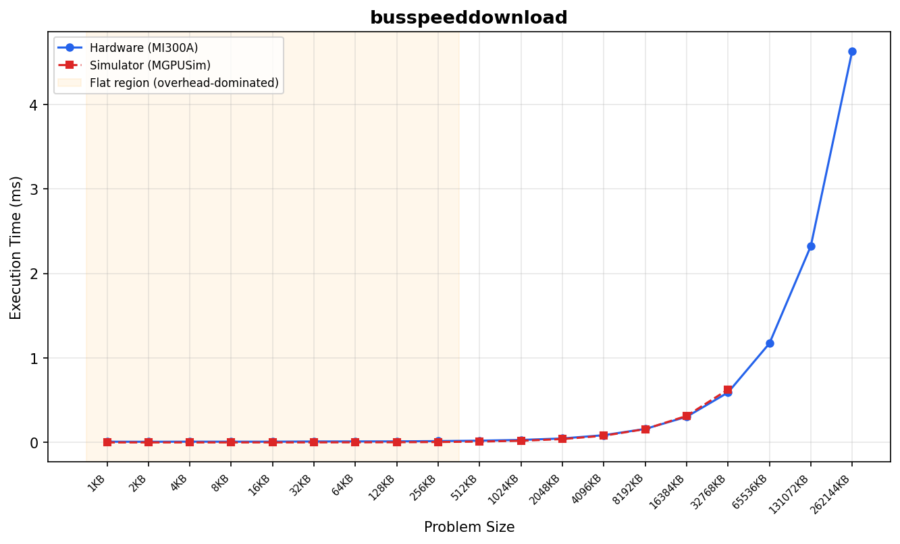

### busspeedreadback

**Points:** 15 total (5 flat, 10 non-flat) 
**Avg Error:** 64.4% (raw), 19.6% (with booster) 
**Scaling Factor Error:** 4.9% · **Booster:** +0.0117 ms 
**HW Slope:** 1.7854e-08 · **Sim Slope:** 1.8722e-08 
**ρ:** +0.9643 · **Status:** ✅ Compliant

| Size | HW (ms) | Sim (ms) | Sim+Booster (ms) | Error (raw) | Error (boosted) | Region |
|------|--------:|---------:|------------------:|------------:|----------------:|--------|
| 1KB | 0.0099 | 0.0002 | 0.0119 | -98.2% | +19.9% | flat |
| 2KB | 0.0076 | 0.0002 | 0.0119 | -97.3% | +56.4% | flat |
| 4KB | 0.0075 | 0.0002 | 0.0119 | -96.7% | +59.1% | flat |
| 8KB | 0.0067 | 0.0003 | 0.0120 | -95.1% | +79.3% | flat |
| 16KB | 0.0117 | 0.0005 | 0.0122 | -95.8% | +4.1% | flat |
| 32KB | 0.0142 | 0.0008 | 0.0125 | -94.2% | -11.9% | **non-flat** |
| 64KB | 0.0151 | 0.0014 | 0.0131 | -90.4% | -13.0% | **non-flat** |
| 128KB | 0.0162 | 0.0027 | 0.0144 | -83.5% | -11.4% | **non-flat** |
| 256KB | 0.0196 | 0.0052 | 0.0169 | -73.6% | -14.0% | **non-flat** |
| 512KB | 0.0218 | 0.0101 | 0.0218 | -53.6% | +0.0% | **non-flat** |
| 1024KB | 0.0354 | 0.0200 | 0.0317 | -43.5% | -10.5% | **non-flat** |
| 2048KB | 0.0518 | 0.0398 | 0.0515 | -23.1% | -0.5% | **non-flat** |
| 4096KB | 0.0948 | 0.0795 | 0.0911 | -16.2% | -3.9% | **non-flat** |
| 8192KB | 0.1632 | 0.1581 | 0.1698 | -3.1% | +4.0% | **non-flat** |
| 16384KB | 0.3089 | 0.3139 | 0.3256 | +1.6% | +5.4% | **non-flat** |

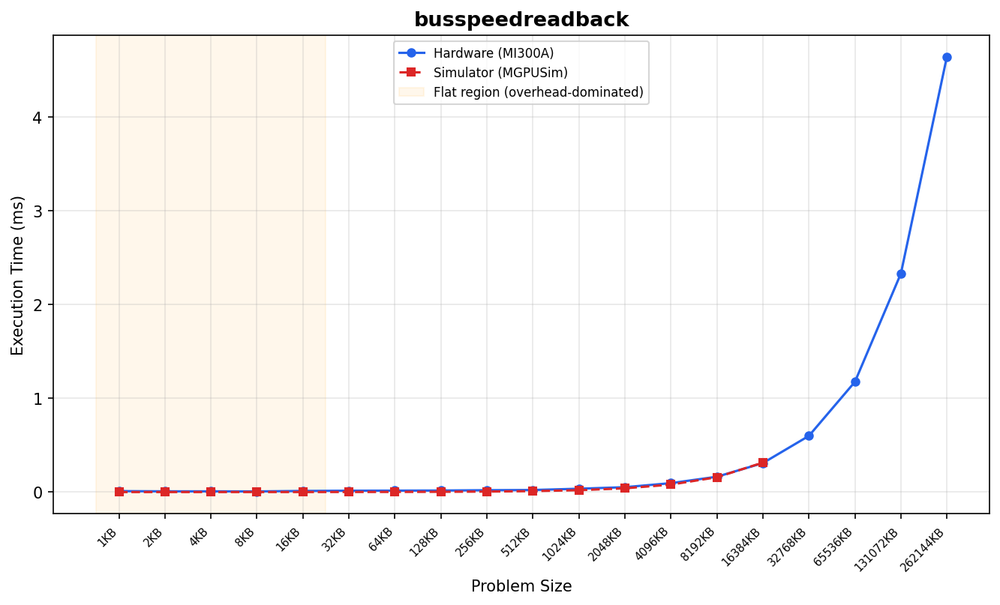

### devicememory_write

**Points:** 9 total (4 flat, 5 non-flat) 
**Avg Error:** 81.2% (raw), 101.3% (with booster) 
**Scaling Factor Error:** 213.1% · **Booster:** -0.0086 ms 
**HW Slope:** 4.9355e-10 · **Sim Slope:** 1.5454e-09 
**ρ:** +1.0000 · **Status:** ✅ Compliant

| Size | HW (ms) | Sim (ms) | Sim+Booster (ms) | Error (raw) | Error (boosted) | Region |
|------|--------:|---------:|------------------:|------------:|----------------:|--------|
| 1MB | 0.0054 | 0.0020 | -0.0066 | -63.5% | -222.5% | flat |
| 2MB | 0.0059 | 0.0036 | -0.0050 | -38.5% | -184.0% | flat |
| 4MB | 0.0074 | 0.0069 | -0.0017 | -6.6% | -122.6% | flat |
| 8MB | 0.0098 | 0.0135 | 0.0049 | +37.3% | -50.3% | flat |
| 12MB | 0.0114 | 0.0200 | 0.0114 | +75.3% | +0.0% | **non-flat** |
| 16MB | 0.0139 | 0.0265 | 0.0179 | +90.3% | +28.6% | **non-flat** |
| 24MB | 0.0180 | 0.0394 | 0.0308 | +118.8% | +71.1% | **non-flat** |
| 32MB | 0.0220 | 0.0523 | 0.0437 | +137.8% | +98.7% | **non-flat** |
| 48MB | 0.0297 | 0.0782 | 0.0696 | +163.2% | +134.3% | **non-flat** |

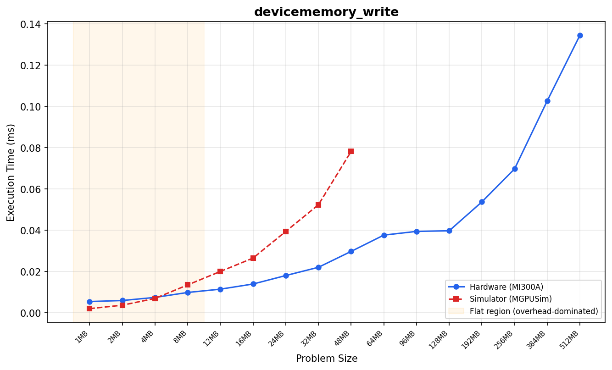

### ep

**Points:** 11 total (1 flat, 10 non-flat) 
**Avg Error:** 77.0% (raw), 25.5% (with booster) 
**Scaling Factor Error:** 56.1% · **Booster:** +0.0183 ms 
**HW Slope:** 3.4904e-08 · **Sim Slope:** 1.5314e-08 
**ρ:** +0.7545 · **Status:** ✅ Compliant

| Size | HW (ms) | Sim (ms) | Sim+Booster (ms) | Error (raw) | Error (boosted) | Region |
|------|--------:|---------:|------------------:|------------:|----------------:|--------|
| 512 | 0.0062 | 0.0021 | 0.0204 | -65.5% | +229.8% | flat |
| 1024 | 0.0227 | 0.0044 | 0.0227 | -80.7% | -0.0% | **non-flat** |
| 2048 | 0.0227 | 0.0044 | 0.0227 | -80.6% | +0.0% | **non-flat** |
| 4096 | 0.0213 | 0.0044 | 0.0227 | -79.4% | +6.6% | **non-flat** |
| 8192 | 0.0240 | 0.0044 | 0.0227 | -81.7% | -5.4% | **non-flat** |
| 16384 | 0.0232 | 0.0044 | 0.0227 | -80.9% | -2.0% | **non-flat** |
| 32768 | 0.0230 | 0.0045 | 0.0229 | -80.2% | -0.6% | **non-flat** |
| 65536 | 0.0224 | 0.0048 | 0.0231 | -78.7% | +3.0% | **non-flat** |
| 131072 | 0.0244 | 0.0053 | 0.0236 | -78.4% | -3.4% | **non-flat** |
| 262144 | 0.0237 | 0.0068 | 0.0251 | -71.2% | +6.0% | **non-flat** |
| 524288 | 0.0403 | 0.0125 | 0.0308 | -69.1% | -23.7% | **non-flat** |

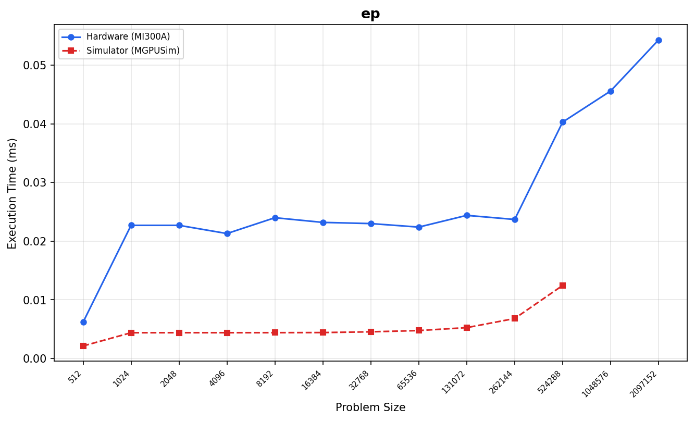

### fused_swiglu

**Points:** 6 total (5 flat, 1 non-flat) 
**Avg Error:** 108.3% (raw), 109.6% (with booster) 
**Scaling Factor Error:** 680.8% · **Booster:** -0.0005 ms 
**HW Slope:** 3.4125e-09 · **Sim Slope:** 2.6647e-08 
**ρ:** +1.0000 · **Status:** ⚠️ Non-compliant (non-flat: 1/5)

| Size | HW (ms) | Sim (ms) | Sim+Booster (ms) | Error (raw) | Error (boosted) | Region |
|------|--------:|---------:|------------------:|------------:|----------------:|--------|
| n1572864_bs256_ept1_p1 | 0.0101 | 0.0425 | 0.0421 | +321.1% | +316.5% | **non-flat** |
| n196608_bs256_ept1_p1 | 0.0053 | 0.0040 | 0.0035 | -24.7% | -33.6% | flat |
| n393216_bs256_ept1_p1 | 0.0054 | 0.0076 | 0.0072 | +41.6% | +32.9% | flat |
| n49152_bs256_ept1_p1 | 0.0048 | 0.0013 | 0.0008 | -73.7% | -83.5% | flat |
| n786432_bs256_ept1_p1 | 0.0064 | 0.0150 | 0.0145 | +134.1% | +126.8% | flat |
| n98304_bs256_ept1_p1 | 0.0048 | 0.0022 | 0.0017 | -54.8% | -64.6% | flat |

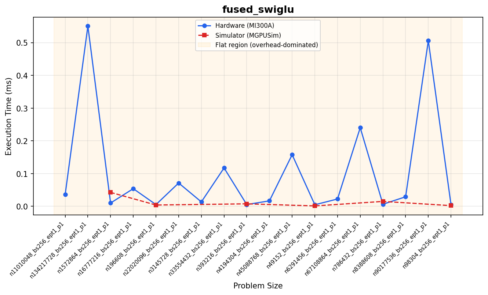

### global_bw_copy

**Points:** 8 total (4 flat, 4 non-flat) 
**Avg Error:** 206.9% (raw), 240.6% (with booster) 
**Scaling Factor Error:** 512.1% · **Booster:** -0.0229 ms 
**HW Slope:** 5.0491e-10 · **Sim Slope:** 3.0906e-09 
**ρ:** +1.0000 · **Status:** ⚠️ Non-compliant (non-flat: 4/5)

| Size | HW (ms) | Sim (ms) | Sim+Booster (ms) | Error (raw) | Error (boosted) | Region |
|------|--------:|---------:|------------------:|------------:|----------------:|--------|
| 1048576 | 0.0045 | 0.0036 | -0.0193 | -20.3% | -529.0% | flat |
| 2097152 | 0.0052 | 0.0069 | -0.0160 | +32.0% | -408.3% | flat |
| 4194304 | 0.0063 | 0.0134 | -0.0095 | +112.3% | -251.1% | flat |
| 8388608 | 0.0088 | 0.0264 | 0.0035 | +199.8% | -60.4% | flat |
| 12582912 | 0.0112 | 0.0394 | 0.0165 | +251.8% | +47.4% | **non-flat** |
| 16777216 | 0.0137 | 0.0523 | 0.0294 | +282.0% | +114.9% | **non-flat** |
| 25165824 | 0.0172 | 0.0782 | 0.0553 | +354.5% | +221.4% | **non-flat** |
| 33554432 | 0.0207 | 0.1041 | 0.0812 | +402.7% | +292.1% | **non-flat** |

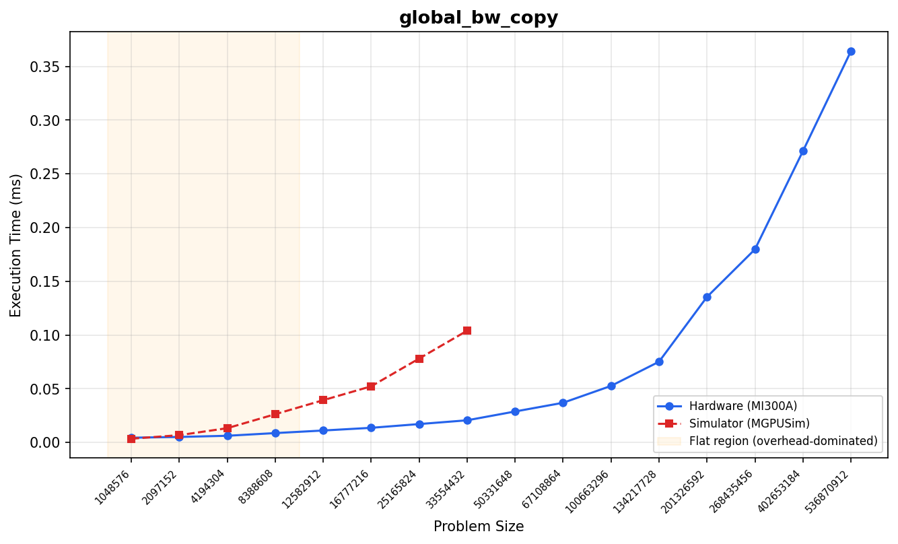

### hist

**Points:** 16 total (8 flat, 8 non-flat) 
**Avg Error:** 72.8% (raw), 33.7% (with booster) 
**Scaling Factor Error:** 242.2% · **Booster:** +0.0050 ms 
**HW Slope:** 1.8112e-09 · **Sim Slope:** 6.1988e-09 
**ρ:** +0.9824 · **Status:** ✅ Compliant

| Size | HW (ms) | Sim (ms) | Sim+Booster (ms) | Error (raw) | Error (boosted) | Region |
|------|--------:|---------:|------------------:|------------:|----------------:|--------|
| 512 | 0.0063 | 0.0011 | 0.0061 | -83.1% | -4.0% | flat |
| 1024 | 0.0063 | 0.0011 | 0.0061 | -82.1% | -3.0% | flat |
| 2048 | 0.0063 | 0.0013 | 0.0063 | -79.0% | +0.2% | flat |
| 4096 | 0.0066 | 0.0017 | 0.0067 | -74.6% | +1.0% | flat |
| 8192 | 0.0072 | 0.0025 | 0.0075 | -65.1% | +4.2% | flat |
| 16384 | 0.0072 | 0.0027 | 0.0077 | -61.8% | +7.4% | flat |
| 32768 | 0.0077 | 0.0027 | 0.0077 | -64.8% | -0.0% | flat |
| 65536 | 0.0097 | 0.0030 | 0.0080 | -69.1% | -17.7% | flat |
| 131072 | 0.0134 | 0.0030 | 0.0080 | -77.5% | -40.3% | **non-flat** |
| 262144 | 0.0205 | 0.0049 | 0.0099 | -75.9% | -51.6% | **non-flat** |
| 524288 | 0.0205 | 0.0065 | 0.0114 | -68.5% | -44.2% | **non-flat** |
| 1048576 | 0.0208 | 0.0103 | 0.0152 | -50.7% | -26.7% | **non-flat** |
| 2097152 | 0.0212 | 0.0162 | 0.0212 | -23.5% | +0.0% | **non-flat** |
| 4194304 | 0.0246 | 0.0283 | 0.0333 | +15.2% | +35.5% | **non-flat** |
| 8388608 | 0.0286 | 0.0559 | 0.0609 | +95.4% | +112.9% | **non-flat** |
| 16777216 | 0.0380 | 0.1055 | 0.1105 | +177.6% | +190.7% | **non-flat** |

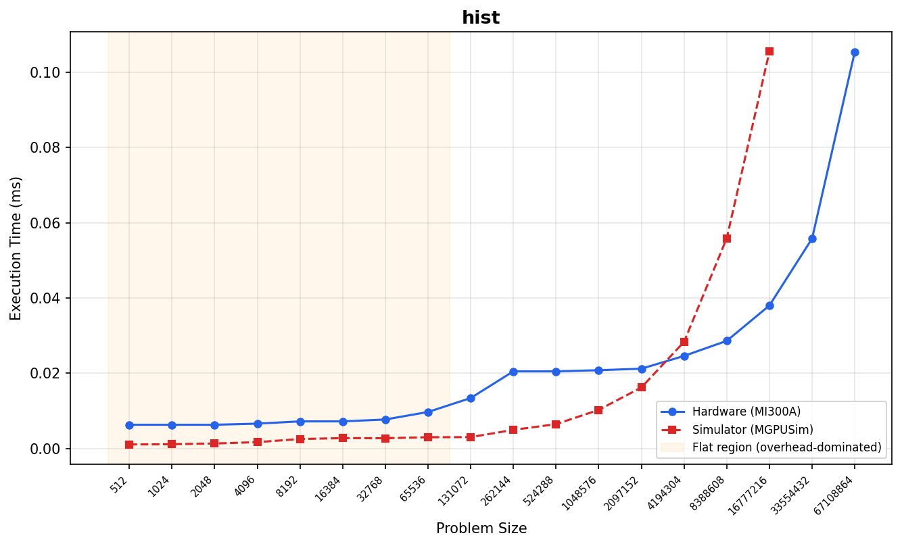

### hotspot

**Points:** 11 total (6 flat, 5 non-flat) 
**Avg Error:** 93.4% (raw), 38.1% (with booster) 
**Scaling Factor Error:** 91.7% · **Booster:** +0.0860 ms 
**HW Slope:** 2.9374e-04 · **Sim Slope:** 2.4393e-05 
**ρ:** +0.8273 · **Status:** ✅ Compliant

| Size | HW (ms) | Sim (ms) | Sim+Booster (ms) | Error (raw) | Error (boosted) | Region |
|------|--------:|---------:|------------------:|------------:|----------------:|--------|
| 32 | 0.0579 | 0.0047 | 0.0906 | -92.0% | +56.5% | flat |
| 48 | 0.0908 | 0.0048 | 0.0908 | -94.7% | +0.0% | flat |
| 64 | 0.0620 | 0.0049 | 0.0908 | -92.2% | +46.5% | flat |
| 96 | 0.0677 | 0.0047 | 0.0907 | -93.1% | +34.0% | flat |
| 128 | 0.0701 | 0.0048 | 0.0908 | -93.2% | +29.5% | flat |
| 192 | 0.0862 | 0.0048 | 0.0908 | -94.5% | +5.3% | flat |
| 256 | 0.1182 | 0.0059 | 0.0918 | -95.0% | -22.3% | **non-flat** |
| 384 | 0.2214 | 0.0079 | 0.0939 | -96.4% | -57.6% | **non-flat** |
| 512 | 0.3575 | 0.0118 | 0.0978 | -96.7% | -72.6% | **non-flat** |
| 640 | 0.1900 | 0.0177 | 0.1037 | -90.7% | -45.4% | **non-flat** |
| 768 | 0.2199 | 0.0246 | 0.1105 | -88.8% | -49.7% | **non-flat** |

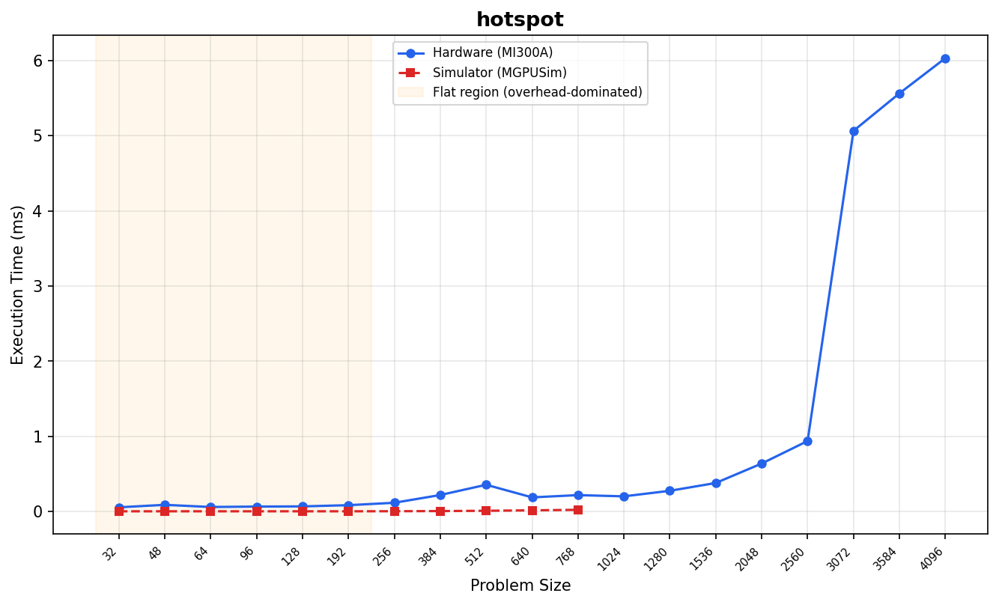

### l1_cache_bw

**Points:** 16 total (16 flat, 0 non-flat) 
**Report classification:** cache bandwidth work-scaling sweep (pending value-change proof) 
**Work axis:** `num_elements` scales total reads: total_read_bytes = num_elements * num_iterations * bytes_per_read; HIP/CUDA default 262144000 B; repeat count HIP/CUDA `num_iterations`, Go simulator `num_repeats`. 
**Implementation footprint:** HIP/CUDA fixed working_set_size 8192 B; repeat num_iterations; Go simulator 256-thread read groups (1024 B each); input bytes = ceil(num_elements / 256) * 256 * bytes_per_read; repeat num_repeats 
**Metric policy:** booster and trend/scaling are diagnostic only; excluded from aggregate targets until loaded `num_elements` rows prove non-flat/value-changing work-scaling behavior. 
**Avg Error:** 94.0% (raw), not scored (diag 1.2%) (with booster) 
**Scaling Factor Error:** not scored (diag 78.6%) · **Booster:** +0.1150 ms 
**HW Slope:** 2.7111e-08 · **Sim Slope:** 5.8040e-09 
**ρ:** +0.7941 · **Status:** ✅ Compliant

| Size | HW (ms) | Sim (ms) | Sim+Booster (ms) | Error (raw) | Error (boosted) | Region |
|------|--------:|---------:|------------------:|------------:|----------------:|--------|
| 1024 | 0.1202 | 0.0073 | 0.1224 | -93.9% | +1.8% | flat (value-change proof pending) |
| 2048 | 0.1203 | 0.0073 | 0.1224 | -93.9% | +1.7% | flat (value-change proof pending) |
| 3072 | 0.1208 | 0.0073 | 0.1224 | -93.9% | +1.3% | flat (value-change proof pending) |
| 4096 | 0.1217 | 0.0073 | 0.1224 | -94.0% | +0.6% | flat (value-change proof pending) |
| 6144 | 0.1215 | 0.0074 | 0.1224 | -93.9% | +0.7% | flat (value-change proof pending) |
| 8192 | 0.1226 | 0.0074 | 0.1224 | -94.0% | -0.2% | flat (value-change proof pending) |
| 10240 | 0.1220 | 0.0074 | 0.1224 | -94.0% | +0.3% | flat (value-change proof pending) |
| 12288 | 0.1214 | 0.0074 | 0.1224 | -93.9% | +0.8% | flat (value-change proof pending) |
| 14336 | 0.1226 | 0.0074 | 0.1224 | -94.0% | -0.2% | flat (value-change proof pending) |
| 16384 | 0.1380 | 0.0074 | 0.1224 | -94.7% | -11.3% | flat (value-change proof pending) |
| 20480 | 0.1228 | 0.0074 | 0.1225 | -93.9% | -0.3% | flat (value-change proof pending) |
| 24576 | 0.1227 | 0.0075 | 0.1225 | -93.9% | -0.2% | flat (value-change proof pending) |
| 28672 | 0.1225 | 0.0075 | 0.1225 | -93.9% | -0.0% | flat (value-change proof pending) |
| 32768 | 0.1225 | 0.0075 | 0.1225 | -93.9% | +0.0% | flat (value-change proof pending) |
| 49152 | 0.1230 | 0.0076 | 0.1226 | -93.9% | -0.3% | flat (value-change proof pending) |
| 65536 | 0.1228 | 0.0077 | 0.1228 | -93.7% | -0.0% | flat (value-change proof pending) |

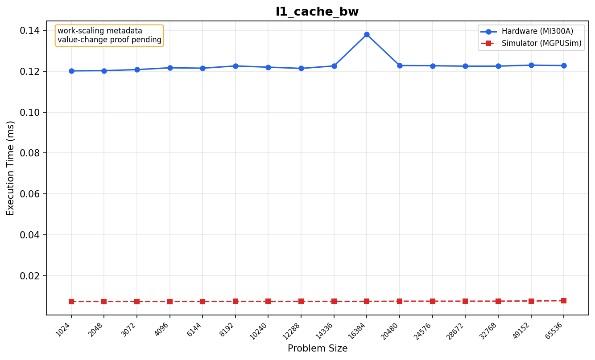

### l2_cache_bw

**Points:** 5 total (5 flat, 0 non-flat) 
**Report classification:** cache bandwidth work-scaling sweep (pending value-change proof) 
**Work axis:** `num_elements` scales total reads: total_read_bytes = num_elements * num_iterations * bytes_per_read; HIP/CUDA default 524288000 B; repeat count HIP/CUDA `num_iterations`, Go simulator `num_repeats`. 
**Metric policy:** booster and trend/scaling are diagnostic only; excluded from aggregate targets until loaded `num_elements` rows prove non-flat/value-changing work-scaling behavior. 
**Avg Error:** 89.5% (raw), not scored (diag 0.4%) (with booster) 
**Scaling Factor Error:** not scored (diag 369.9%) · **Booster:** +0.0832 ms 
**HW Slope:** -2.0469e-10 · **Sim Slope:** 5.5248e-10 
**ρ:** -0.5000 · **Status:** ✅ Compliant

| Size | HW (ms) | Sim (ms) | Sim+Booster (ms) | Error (raw) | Error (boosted) | Region |
|------|--------:|---------:|------------------:|------------:|----------------:|--------|
| 32768 | 0.0929 | 0.0101 | 0.0932 | -89.1% | +0.4% | flat (value-change proof pending) |
| 65536 | 0.0928 | 0.0096 | 0.0928 | -89.6% | +0.0% | flat (value-change proof pending) |
| 131072 | 0.0932 | 0.0096 | 0.0928 | -89.7% | -0.4% | flat (value-change proof pending) |
| 196608 | 0.0929 | 0.0092 | 0.0924 | -90.1% | -0.6% | flat (value-change proof pending) |
| 262144 | 0.0928 | 0.0104 | 0.0935 | -88.8% | +0.8% | flat (value-change proof pending) |

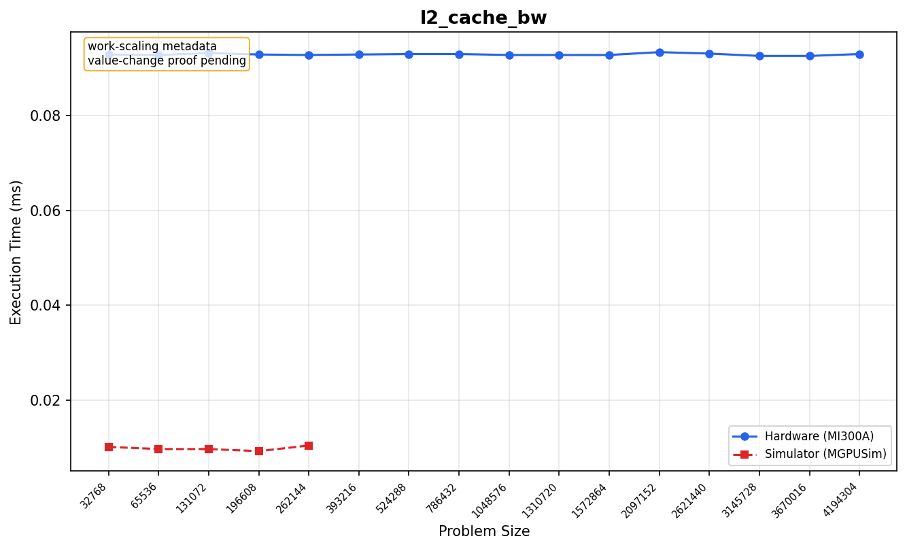

### lud

**Points:** 7 total (1 flat, 6 non-flat) 
**Avg Error:** 54.2% (raw), 57.0% (with booster) 
**Scaling Factor Error:** 53.0% · **Booster:** +0.5789 ms 
**HW Slope:** 4.3013e-03 · **Sim Slope:** 2.0232e-03 
**ρ:** +1.0000 · **Status:** ✅ Compliant

| Size | HW (ms) | Sim (ms) | Sim+Booster (ms) | Error (raw) | Error (boosted) | Region |
|------|--------:|---------:|------------------:|------------:|----------------:|--------|
| 64 | 0.2043 | 0.0940 | 0.6729 | -54.0% | +229.4% | flat |
| 128 | 0.4737 | 0.2200 | 0.7989 | -53.6% | +68.6% | **non-flat** |
| 192 | 0.7662 | 0.3494 | 0.9283 | -54.4% | +21.2% | **non-flat** |
| 256 | 1.0565 | 0.4776 | 1.0565 | -54.8% | +0.0% | **non-flat** |
| 384 | 1.6394 | 0.7337 | 1.3126 | -55.2% | -19.9% | **non-flat** |
| 512 | 2.2748 | 0.9878 | 1.5667 | -56.6% | -31.1% | **non-flat** |
| 640 | 2.5863 | 1.2648 | 1.8436 | -51.1% | -28.7% | **non-flat** |

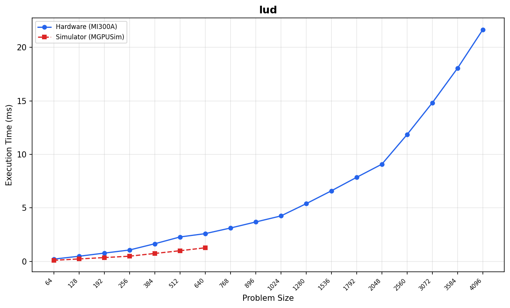

### nn

**Points:** 11 total (11 flat, 0 non-flat) 
**Avg Error:** 82.4% (raw), 51.7% (with booster) 
**Scaling Factor Error:** 910.9% · **Booster:** +0.0036 ms 
**HW Slope:** 1.8248e-09 · **Sim Slope:** 1.8447e-08 
**ρ:** +0.6455 · **Status:** ⚠️ Non-compliant (non-flat: 0/5)

| Size | HW (ms) | Sim (ms) | Sim+Booster (ms) | Error (raw) | Error (boosted) | Region |
|------|--------:|---------:|------------------:|------------:|----------------:|--------|
| 1024 | 0.0043 | 0.0006 | 0.0043 | -85.7% | -1.0% | flat |
| 2048 | 0.0044 | 0.0006 | 0.0043 | -85.9% | -3.2% | flat |
| 4096 | 0.0052 | 0.0006 | 0.0043 | -88.0% | -18.0% | flat |
| 8192 | 0.0051 | 0.0006 | 0.0043 | -87.6% | -16.2% | flat |
| 16384 | 0.0049 | 0.0007 | 0.0044 | -85.2% | -11.0% | flat |
| 32768 | 0.0046 | 0.0010 | 0.0046 | -79.1% | +0.0% | flat |
| 65536 | 0.0046 | 0.0016 | 0.0052 | -66.0% | +13.2% | flat |
| 131072 | 0.0050 | 0.0028 | 0.0064 | -44.4% | +28.4% | flat |
| 262144 | 0.0050 | 0.0052 | 0.0088 | +4.1% | +76.9% | flat |
| 524288 | 0.0055 | 0.0101 | 0.0137 | +83.5% | +149.7% | flat |
| 1048576 | 0.0067 | 0.0199 | 0.0235 | +196.4% | +250.7% | flat |

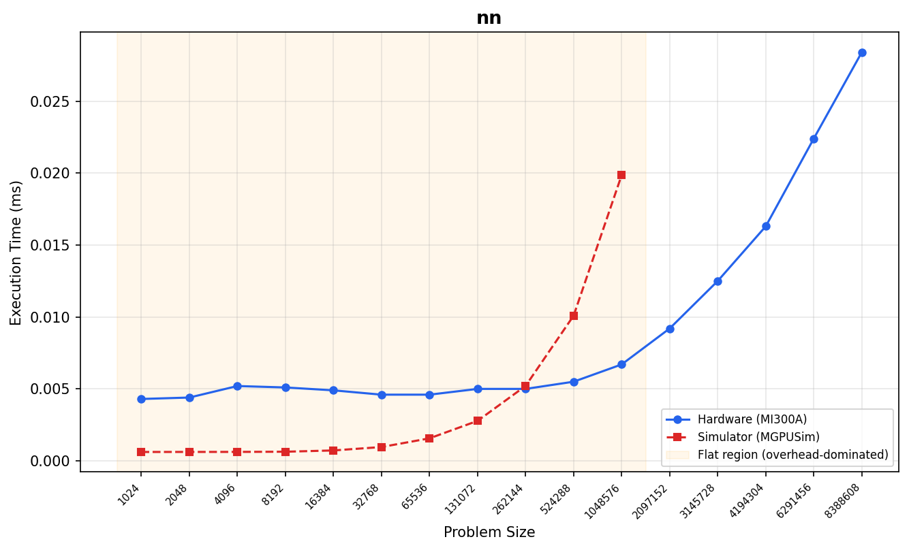

### nw

**Points:** 7 total (1 flat, 6 non-flat) 
**Avg Error:** 65.6% (raw), 56.3% (with booster) 
**Scaling Factor Error:** 58.2% · **Booster:** +0.3519 ms 
**HW Slope:** 1.7695e-03 · **Sim Slope:** 7.3904e-04 
**ρ:** +1.0000 · **Status:** ✅ Compliant

| Size | HW (ms) | Sim (ms) | Sim+Booster (ms) | Error (raw) | Error (boosted) | Region |
|------|--------:|---------:|------------------:|------------:|----------------:|--------|
| 64 | 0.1284 | 0.0392 | 0.3911 | -69.4% | +204.6% | flat |
| 128 | 0.2613 | 0.0790 | 0.4309 | -69.8% | +64.9% | **non-flat** |
| 192 | 0.3784 | 0.1195 | 0.4714 | -68.4% | +24.6% | **non-flat** |
| 256 | 0.5133 | 0.1614 | 0.5133 | -68.6% | +0.0% | **non-flat** |
| 512 | 0.9085 | 0.3430 | 0.6948 | -62.2% | -23.5% | **non-flat** |
| 768 | 1.3848 | 0.5373 | 0.8892 | -61.2% | -35.8% | **non-flat** |
| 1024 | 1.8537 | 0.7512 | 1.1031 | -59.5% | -40.5% | **non-flat** |

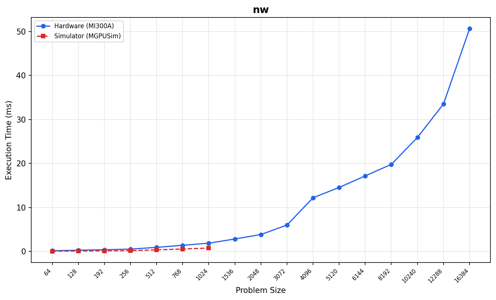

### particlefilter

**Points:** 7 total (2 flat, 5 non-flat) 
**Avg Error:** 81.9% (raw), 82.0% (with booster) 
**Scaling Factor Error:** 78.3% · **Booster:** +2.6630 ms 
**HW Slope:** 1.3391e-03 · **Sim Slope:** 2.9116e-04 
**ρ:** +1.0000 · **Status:** ✅ Compliant

| Size | HW (ms) | Sim (ms) | Sim+Booster (ms) | Error (raw) | Error (boosted) | Region |
|------|--------:|---------:|------------------:|------------:|----------------:|--------|
| 256 | 0.8611 | 0.1006 | 2.7636 | -88.3% | +220.9% | flat |
| 512 | 1.1992 | 0.1783 | 2.8413 | -85.1% | +136.9% | flat |
| 1024 | 1.8960 | 0.3345 | 2.9975 | -82.4% | +58.1% | **non-flat** |
| 2048 | 3.3056 | 0.6426 | 3.3056 | -80.6% | +0.0% | **non-flat** |
| 4096 | 6.0696 | 1.2508 | 3.9138 | -79.4% | -35.5% | **non-flat** |
| 8192 | 11.4950 | 2.4661 | 5.1291 | -78.5% | -55.4% | **non-flat** |
| 16384 | 22.4700 | 4.7902 | 7.4532 | -78.7% | -66.8% | **non-flat** |

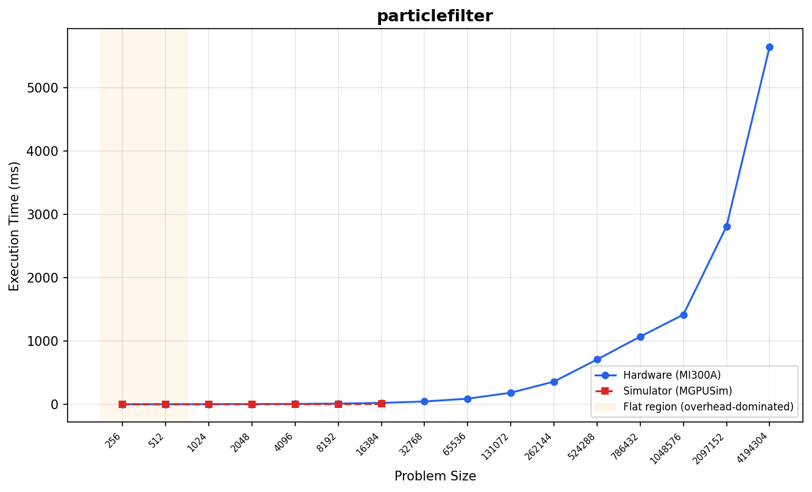

### qtc

**Points:** 10 total (2 flat, 8 non-flat) 
**Avg Error:** 54.0% (raw), 71.6% (with booster) 
**Scaling Factor Error:** 57.8% · **Booster:** +0.0380 ms 
**HW Slope:** 1.6321e-04 · **Sim Slope:** 6.8901e-05 
**ρ:** +1.0000 · **Status:** ✅ Compliant

| Size | HW (ms) | Sim (ms) | Sim+Booster (ms) | Error (raw) | Error (boosted) | Region |
|------|--------:|---------:|------------------:|------------:|----------------:|--------|
| 64 | 0.0118 | 0.0050 | 0.0430 | -57.9% | +264.5% | flat |
| 128 | 0.0186 | 0.0094 | 0.0474 | -49.6% | +154.9% | flat |
| 192 | 0.0246 | 0.0138 | 0.0518 | -44.0% | +110.6% | **non-flat** |
| 256 | 0.0420 | 0.0183 | 0.0563 | -56.5% | +34.1% | **non-flat** |
| 384 | 0.0607 | 0.0270 | 0.0650 | -55.6% | +7.1% | **non-flat** |
| 512 | 0.0783 | 0.0360 | 0.0740 | -54.1% | -5.5% | **non-flat** |
| 768 | 0.1187 | 0.0534 | 0.0914 | -55.0% | -23.0% | **non-flat** |
| 1024 | 0.1557 | 0.0729 | 0.1110 | -53.2% | -28.7% | **non-flat** |
| 1536 | 0.2429 | 0.1062 | 0.1442 | -56.3% | -40.6% | **non-flat** |
| 2048 | 0.3384 | 0.1414 | 0.1794 | -58.2% | -47.0% | **non-flat** |

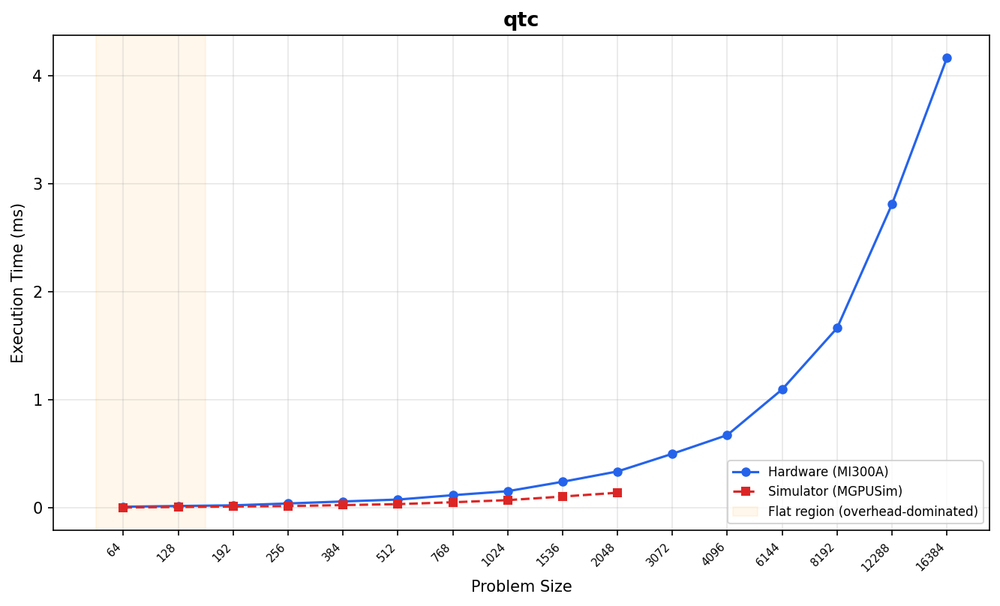

### rope

**Points:** 6 total (2 flat, 4 non-flat) 
**Avg Error:** 113.4% (raw), 130.9% (with booster) 
**Scaling Factor Error:** — · **Booster:** -0.0405 ms 
**HW Slope:** — · **Sim Slope:** — 
**ρ:** +1.0000 · **Status:** ⚠️ Non-compliant (non-flat: 4/5)

| Size | HW (ms) | Sim (ms) | Sim+Booster (ms) | Error (raw) | Error (boosted) | Region |
|------|--------:|---------:|------------------:|------------:|----------------:|--------|
| B4_S128_H32_D128_blk256 | 0.0241 | 0.0285 | -0.0120 | +18.3% | -149.7% | flat |
| B4_S256_H32_D128_blk256 | 0.0341 | 0.0630 | 0.0225 | +84.8% | -33.9% | **non-flat** |
| B4_S384_H32_D128_blk256 | 0.0437 | 0.0958 | 0.0553 | +119.2% | +26.5% | **non-flat** |
| B4_S512_H32_D128_blk256 | 0.0534 | 0.1323 | 0.0918 | +147.8% | +71.9% | **non-flat** |
| B4_S64_H32_D128_blk256 | 0.0163 | 0.0133 | -0.0272 | -18.3% | -266.7% | flat |
| B4_S768_H32_D128_blk256 | 0.0733 | 0.2872 | 0.2467 | +291.9% | +236.6% | **non-flat** |

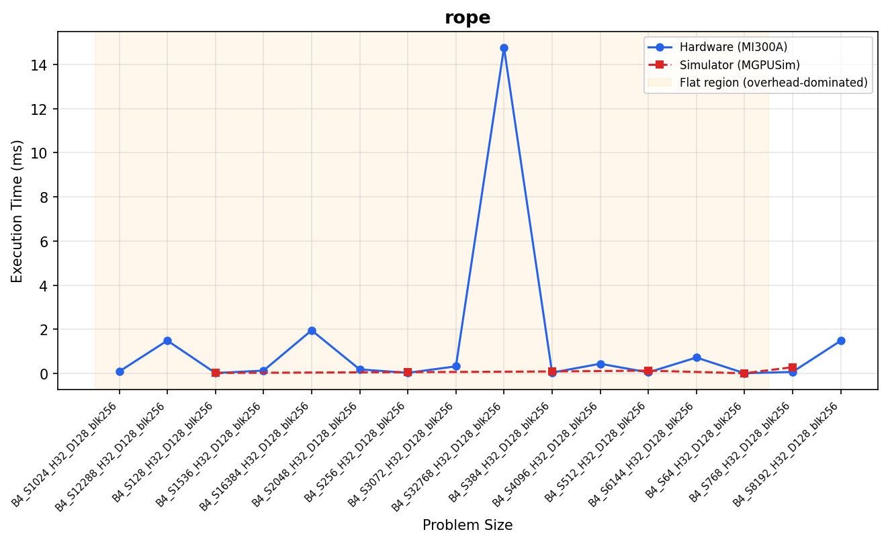

### sgemm_tiled

**Points:** 8 total (3 flat, 5 non-flat) 
**Avg Error:** 34.1% (raw), 2.6% (with booster) 
**Scaling Factor Error:** 2.6% · **Booster:** +0.0042 ms 
**HW Slope:** 5.9468e-05 · **Sim Slope:** 6.1003e-05 
**ρ:** +1.0000 · **Status:** ✅ Compliant

| Size | HW (ms) | Sim (ms) | Sim+Booster (ms) | Error (raw) | Error (boosted) | Region |
|------|--------:|---------:|------------------:|------------:|----------------:|--------|
| 64 | 0.0063 | 0.0023 | 0.0065 | -63.3% | +3.7% | flat |
| 128 | 0.0082 | 0.0040 | 0.0082 | -51.5% | -0.1% | flat |
| 192 | 0.0102 | 0.0059 | 0.0101 | -42.3% | -1.0% | flat |
| 256 | 0.0129 | 0.0080 | 0.0123 | -37.7% | -5.0% | **non-flat** |
| 320 | 0.0151 | 0.0100 | 0.0142 | -33.8% | -5.9% | **non-flat** |
| 384 | 0.0200 | 0.0161 | 0.0203 | -19.7% | +1.4% | **non-flat** |
| 448 | 0.0262 | 0.0220 | 0.0262 | -16.1% | +0.0% | **non-flat** |
| 512 | 0.0346 | 0.0317 | 0.0359 | -8.5% | +3.7% | **non-flat** |

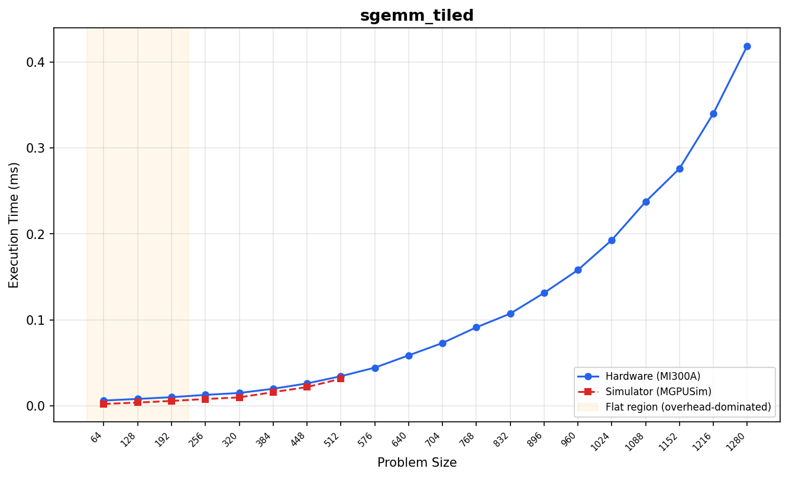

---

## 5. Methodology

### Region Classification

Each data point is classified based on hardware execution time:

- **Flat region:** `hw_time ≤ 2 × min(hw_time)` for that kernel. Kernel launch overhead or a hardware plateau dominates.
- **Non-flat region:** `hw_time > 2 × min(hw_time)`. Compute/memory behaviour dominates.
- **Report-classified hardware-flat sweeps:** benchmarks may carry metadata identifying an archived true hardware-flat selected region whose x-axis was a cache-residency/footprint sweep rather than a work-amount sweep. The diagnostic-only policy applies only when the loaded report rows still match the selected-run provenance and row count/min/max checks.
- **Report-classified cache-bandwidth work sweeps:** current L1/L2 metadata marks `num_elements` as a work-amount axis and defines total read bytes. The repeat count is named `num_iterations` in HIP/CUDA workloads and `num_repeats` in Go simulator runs. For L1, HIP/CUDA keeps the total `working_set_size` fixed, while the Go simulator uses per-256-thread read-group reuse and a `num_elements`-scaled input allocation. These rows are scored and trended only when loaded hardware rows prove non-flat/value-changing behavior; otherwise the rows remain diagnostic pending value-change proof.

### Per-Benchmark Booster

Each scored benchmark receives a constant booster `c` (fit by median of `hw - sim`) added to all simulated points. This absorbs systematic offsets from unmodeled overheads (kernel launch, driver stack, etc.) without changing the simulator itself. For report-classified constant-work hardware-flat sweeps, or work-scaling sweeps pending loaded value-change proof, the booster value is shown only as a diagnostic and is excluded from aggregate boosted accuracy and trend/scaling targets.

### Primary Metrics

- **Average Error (scored booster):** Mean of per-point `|sim + c - hw| / hw` for informative scaling axes. Target: ≤ 20% (Tier 2), ≤ 10% (Tier 1).
- **Scaling Factor Error:** Linear regression of `time` vs `input_size` for both HW and boosted-sim on informative scaling axes. Error = `|slope_sim - slope_hw| / |slope_hw|`. Target: ≤ 20% average.

### Supporting Metrics

- **WMAPE** (Weighted Mean Absolute Percentage Error): `Σ|sim - hw| / Σ hw`
- **Spearman ρ**: Rank correlation between HW and sim times (requires ≥ 3 points)

### Minimum Point Requirements

- **Tier 2:** ≥ 1 flat point + ≥ 5 non-flat points
- **Tier 1:** ≥ 2 points per auto-detected regime, ≥ 5 total (subject to author review)
- **Curated partial entries:** retained manifest entries with `coverage_status=partial` are not counted as full point-coverage passes; their current CSV gaps are reported explicitly.

### Accuracy Targets

| Tier | Avg Error (scored booster) | Scaling Factor Error |
|------|--------------------:|---------------------:|
| Tier 1 (microbenchmarks) | ≤ 10% | ≤ 20% |
| Tier 2 (algorithm kernels) | ≤ 20% | ≤ 20% |

### References

- **Point selection policy:** [validation_point_selection.md](validation_point_selection.md)
- **Raw data:** `benchmark-comparison/comparison_ci.csv`
- **Generator:** `scripts/generate_validation_report.py`
